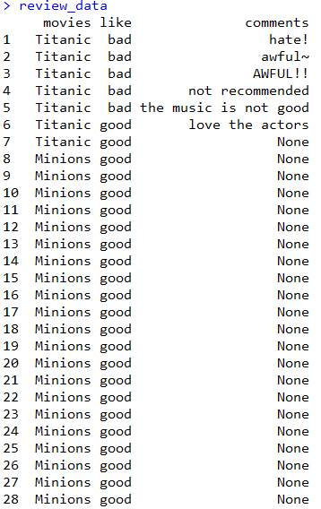
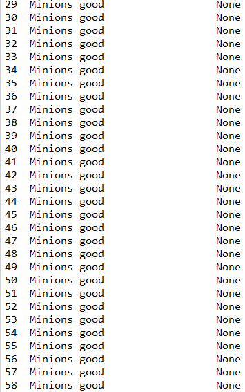
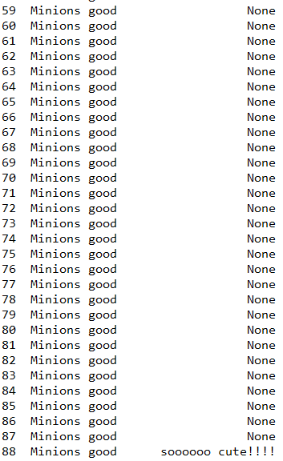

Introducing Data Science with R - Lab Session
========================================================
author: Yu-Yun Chang
date: Oct. 20, 2016
width: 1440
height: 900


Lab Session Week 6 - Dataframe and Lists
========================================================
type: section


Before we get started
========================================================


- install the package __datasets__ and __MASS__ load it in


```r
require(datasets)
require(MASS)
```


- We would use __sleep__ and __phones__ in this lab session


Recap with quick questions
========================================================
type: section


Question 1
========================================
type: sub-section

- What are the differences between dataframes and lists?


Answer 1
===============================
type: sub-section


Question 2
======================
type: sub-section

Explore datasets __sleep__ and __phones__.
- Which dataset is a list?


Answer 2
======================
type: sub-section


Question 3
======================
type: sub-section

- Which column within __sleep__ data is an ordered factor?


Answer 3
======================
type: sub-section


Question 4
======================
type: sub-section

- Extract the rows of `group 1` in __sleep__


Answer 4
======================
type: sub-section


Question 5
======================
type: sub-section

- Extract the rows that have negative values in `extra` column.


Answer 5
======================
type: sub-section


Question 6
======================
type: sub-section

- Explore dataset __phones__, and extract the first 6 elements within the column `year`


Answer 6
======================
type: sub-section


Question 7
======================
type: sub-section

- Create a new list __ALL__, which contains both the datasets __sleep__ and __phones__


Answer 7
======================
type: sub-section


Exercises
======================
type: section


Before we get started ...
=====================
type: sub-section

Copy and paste the below information.


```r
movies <- c('Titanic', 'Minions')
like <- c(rep('bad',5), rep('good',2), rep('good', 100))
comments <- c('hate!', 'awful~', 'AWFUL!!','not recommended', 
              'the music is not good', 'love the actors', 
              rep('soooooo cute!!!!', 20))
```


Questions
=====================
type: sub-section

- Create a list, `reviews`. Name the variables within `reviews` as __movies__, __like__, and __comments__
- How many people have sent their comments on the movies?


Questions
=====================
type: sub-section


A total of 107 people sent their reviews to the two movies. The first 7 elements of __like__ are for the movie "Titanic", and the rest is for "Minions". 

In addition, the first 6 elements of __comments__ are given by the first 6 "Titanic" reviewers, and the rest of 20 elements is provided by the last 20 "Minions" reviewers.

- Create a dataframe `review_data`, and convert the list `reviews` into a dataframe (with the information given above).
- Extract the rows with `good` reviews.


Questions
=====================
type: sub-section






Answers
=====================
type: sub-section


