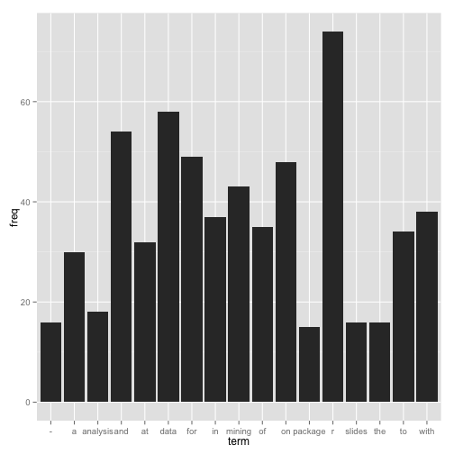

## Course Logistics

- [網頁] <http://loperntu.github.io/lads/>
- [教材] <https://www.gitbook.com/book/loperntu/ladsbook/details>


---
## 練習 [1]

[Lewis Carroll, Alice's Adventures in Wonderland](http://www.gutenberg.org/cache/epub/28885/pg28885.txt)


```bash
wget http://www.gutenberg.org/cache/epub/28885/pg28885.txt
## alternatively
curl -s http://www.gutenberg.org/cache/epub/28885/pg28885.txt -o alice.txt
file pg28885.txt
cp pg28885.txt alice.txt
head -n 20 alice.txt
less -N alice.txt
```

---
## 練習 [1]

- Trimming the header and footer


```bash
sed '1,216d' alice.txt > alice-noheader.txt
sed '3422,3830d' alice-noheader.txt > alice-trimmed.txt
```
- Counting and Finding 


```bash
wc alice-trimmed.txt
grep -n "Rabbit" trimmed.txt
grep -E -n "(W|w)hite" trimmed.txt
```

[參考](http://williamjturkel.net/2013/06/15/basic-text-analysis-with-command-line-tools-in-linux/) 

---
## 練習 [1]

- Standardizing the text


```bash
tr -d [:punct:] < alice-trimmed.txt > alice-nopunct.txt
tr [:upper:] [:lower:] < alice-nopunct.txt > alice-lowercase.txt
tr -d '\r' < alice-lowercase.txt > alice-lowercaself.txt
```

- Counting word frequencies more sereiously!


```bash
tr ' ' '\n' < alice-lowercaself.txt > alice-oneword.txt
sort alice-oneword.txt > alice-onewordsort.txt
uniq -c alice-onewordsort.txt > alice-wordfreq.txt
```

---
## 練習 [1]

- Pipelining everything 


```bash
tr ' ' '\n' < alice-lowercaself.txt | sort | uniq -c > alice-wordfreq2.txt

tr '[:punct:]' ' ' < alice-nofooter.txt | tr '[:upper:]' '[:lower:]' | tr '[:blank:]' ' ' |
sort | uniq -c | sed 's/ \{1,\}/","/g' | sed 's/^",//g' | sed 's/$/"/g'

w3m -dump http://www.gnu.org/gnu/manifesto.html | wc
```


--- bg:#FFFAF0
## 大綱
1. DS at the command line
2. __``Text analytics in action``__
3. Linguistics and Data Science 
4. Crash course for R


---
## 做一個例子看看：回想一下這個流程

- Step.1 收集與準備
  - <small>[x] Crawling/storing the text(s)  
  - [x] Pre-processing the text(s) <span style="color:Teal; font-weight:bold">可能就花掉妳 50% 的時間!!</span> </small>
- Step.2 探索觀察與假設 
  - <small> [x] Exploratory data analysis (statistic summary/graphical representation)
  - [ ] Missing value and outlier treatment </small>
- Step.3 自然語言處理、標注與分析
  - <small>[ ] Natural Language Processing w/o Linguistic Analysis
  - [ ] Annotation, analysis (and back to Step.2 if necessary) </small>


---
## 做一個例子看看：回想一下這個流程

- Step.4 預測模型
  - <small>[ ] Predictive modeling (regression, classification, clustering,...)
  - [ ] Estimation of Performance </small>
- Step.5 重製性報告與呈現 
  - [ ] <small> Reproducible (and infographic) Report </small>


---
## Text Analytics in Action

- 目前受歡迎的套件 `tm` (中文處理可以加上 `tmcn`,`jiebaR`)
- 之後可以多利用[CRAN Task View](https://cran.r-project.org/web/views/NaturalLanguageProcessing.html)

> 根據不同需求，有許多不同的套件開發出來，方便使用者在最小的編程努力下最大的混搭利用。
- `tm`,`openNLP`,`qdap`,`koRpus`,`zipfR`,`Rwordseg/JiebaR`,`wordnet`,`qdap`,`Rweibo`, `twitteR`,`facebookR`, ...


---
## 歐巴馬的國情咨文
[Barack Obama's *State of the Union address* 2014]( http://www.whitehouse.gov/the-press-office/2014/01/28/president-barack-obamas-state-union-address)

- 用 `tm` 將資料變成它接受的類別。


```r
library(tm)
path <- "~/Linguistic.Data/4Practice/the-state-of-the-union.txt"
text <- readLines(path,encoding="UTF-8")
vs <- VectorSource(text)
# NOW The text variable is an array of the lines of the statement.
txt <- Corpus(vs)
```

[Source]: Toomey, 2015.

---
## 歐巴馬的國情咨文

- 取決研究目的，有不同的前處理可能。

```r
# Converting text to lowercase
txtlc <- tm_map(txt, tolower)
#inspect(txt[1])
#inspect(txtlc[1])
# Removing punctuation
txtnp <- tm_map(txt, removePunctuation)
# Removing numbers
txtnn <- tm_map(txt, removeNumbers)
# Removing stop words
txtns <- tm_map(txt[1], removeWords, stopwords("english"))
# ......
```


---
## 歐巴馬的國情咨文

- 建立 **term-document matrix** 可以用來建立語詞或文件之間的關聯性。


```r
dtm <- DocumentTermMatrix(txt)
findFreqTerms(dtm,20)
```

 [1] "and"     "are"     "but"     "can"     "every"   "for"     "from"   
 [8] "have"    "it’s"   "like"    "make"    "more"    "new"     "one"    
[15] "our"     "than"    "that"    "that’s" "the"     "their"   "they"   
[22] "this"    "who"     "will"    "with"   

```r
findAssocs(dtm, "work", 0.2)   
```

          work
diplomacy 0.27
“small   0.23
2010,     0.23
again     0.23
along     0.23
biden’s  0.23
cannot    0.23
didn’t   0.23
disagree  0.23
embargo.  0.23
endured;  0.23
europe,   0.23
exist     0.23
francis,  0.23
grit      0.23
hand.     0.23
holiness, 0.23
ideas,    0.23
imposing  0.23
iran,     0.23
it,       0.23
japan,    0.23
laid      0.23
least     0.23
now.      0.23
outlined  0.23
pope      0.23
remaking  0.23
said,     0.23
say       0.23
seek      0.23
separate  0.23
steps.”  0.23
today.    0.23
together  0.23
twenty    0.23
update    0.23
wage,     0.23
where,    0.23
you’ll   0.23
hard      0.22


---
## 歐巴馬的國情咨文


```r
library(Rgraphviz)
plot(dtm, terms = findFreqTerms(dtm, lowfreq = 5)[1:10], corThreshold = 0.5)
```

 


---
## 歐巴馬的國情咨文

- inspect frequent words


```r
(freq.terms <- findFreqTerms(tdm, lowfreq = 15))
```

```
## Error in inherits(x, c("DocumentTermMatrix", "TermDocumentMatrix")): 找不到物件 'tdm'
```

```r
term.freq <- rowSums(as.matrix(tdm))
```

```
## Error in as.matrix(tdm): 找不到物件 'tdm'
```

```r
term.freq <- subset(term.freq, term.freq >= 15)
df <- data.frame(term = names(term.freq), freq = term.freq)
```

---
## 歐巴馬的國情咨文


```r
library(ggplot2)
ggplot(df, aes(x = term, y = freq)) + geom_bar(stat = "identity")
```

 

```r
xlab("Terms") + ylab("Count") + coord_flip()
```

```
## Error in xlab("Terms") + ylab("Count"): 二元運算子中有非數值引數
```


```r
library(wordcloud)
wordcloud(names(freq), freq, min.freq=10)
```

```
## Error in -freq: 一元運算子的引數不正確
```

---
## 那馬英九呢

- `jiebaR` 進行斷詞


```r
# mixseg <= "../data/week3/MYJ1030101.txt"
# 這是生成的結果
#[1] "../data/week3/MYJ1030101.segment1443585454.8642.txt" 還是需要人工清理
data.path.c <- "~/Dropbox/Linguistic.Analysis.and.Data.Science/data/week3/MYJ1030101.clean.txt"
text.c <- readLines(data.path.c,encoding="UTF-8")
```

- 利用 `tmcn` (中文停用詞)


```r
library(tmcn)
vs.c <- VectorSource(text.c)
txt.c <- Corpus(vs.c)
#inspect(txt.c[1:3])
ma.corpus <- tm_map(txt.c, removeWords,stopwordsCN())
```

- 其他留給作業


--- bg:#FFFAF0
## 大綱
1. DS at the command line
2. Text analytics in action
3. __``Linguistics and Data Science``__
4. Crash course for R


---
## 再提醒：文本分析的深度

由<span style="color:blue; font-weight:bold">自然語言表徵</span>的三個軸度

* [**語意軸**] 語料 corpus data、語言資訊 information、語言知識 knowledge
* [**概念軸**] 事實 facts、概念 concepts、領域知識本體 domain ontologies/taxonomies
* [**情緒軸**] 


---
## 目前的 Text Mining，有事嗎？

- 不是套件提供的功能，就是 text analytics。 E.g, `word cloud` 的意義是什麼？
- 客製字詞典的問題（不是所有的人名都是人名；不是所有的情緒表達都以字詞形式呈現）
- 語言處理和情緒處理無法同構
- Text semantics 不等於 (sentence-based) compositional semantics


--- bg:#FFFAF0
## 大綱
1. DS at the command line
2. Text analytics in action
3. Linguistics and Data Science
4. __``Crash course for R``__


---
## 預習

[DataCamp](https://www.datacamp.com/) 預習進度已經放在課程網頁<http://loperntu.github.io/lads/>。


---
## 作業 (20151002)

1. (預習) [DataCamp] 
2. (60%) 用 `linux 指令` 建立「馬英九 103 元旦文告」(`MYJ1030101.clean.txt`) 的詞頻表。
3. (40%) 用 `tm` 與 `tmcn` 套件算出上述文件中出現頻率至少三次的詞。
4. (bonus: 20%) 用 `tm` 與 `jiebaR` 斷詞套件，用 ceiba 上的「馬英九演講文集」做出詞頻表。


