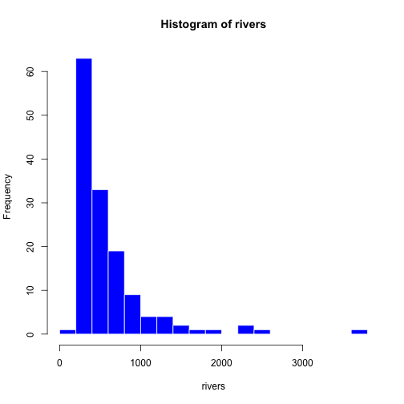
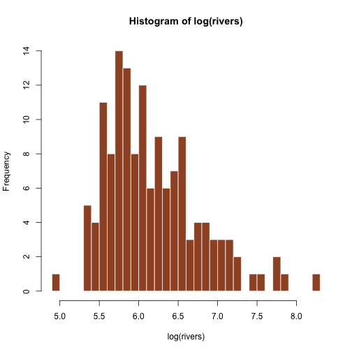
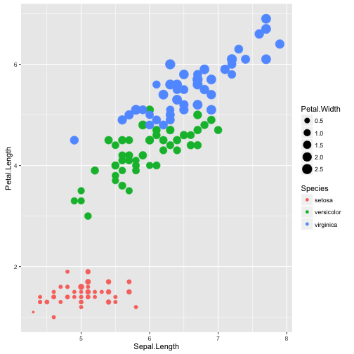

## 大綱
1. __`Basic R and RStudio`__
2. A glace at a data science example
3. Lab session


---
## R 

- 語言 language、編譯 compiler、程式環境 IDE
- The R programming language is (originally) used for statistical computing and graphics.


---
## R 的學習
### 自學教材課程

- [tryr](http://tryr.codeschool.com/)
- [datacamp](https://www.datacamp.com/home)
- [dataquest](https://www.dataquest.io/dashboard)


---
## RStudio 安裝

- RStudio is an open source Integrated Development Environment (IDE) for the R platform. 
- `RStudio Desktop 0.99.903` 還是 [`Preview v 1.0.27`](https://www.rstudio.com/products/rstudio/download/preview/) (推薦) 


---
## RStudio 設定與熟悉

- 版型調整: (Workspace)、(Console)、(Environment and History)、(Files, Plots, Packages, Help, Viewer)
- 目錄結構 (dsr: data, scripts, homework, etc) 


---
## RStudio 設定與熟悉


---
## 用 RStudio 還可以做很多事 (to be continued...)

- 做 ([可重製 reproducible](http://rmarkdown.rstudio.com/lesson-1.html)、[可調參數 Parameterized](http://rmarkdown.rstudio.com/developer_parameterized_reports.html)、[互動型 interactive](http://rmarkdown.rstudio.com/lesson-14.html)) 筆記(notebook) 與報告 (report)
- 做投影片 (presentation) 
- 做網站 (website) 與 web application (using `shiny`)
- 做「數位報表」(dashboard)
- 做專業科學文件 (using $\LaTeX$) 


---
## R 的初體驗


```r
data()	      # browse pre-loaded data sets
data(rivers)	# get this one: "Lengths of Major North American Rivers"
?rivers
head(rivers)	# peek at the data set
```

```
## [1] 735 320 325 392 524 450
```

```r
length(rivers)	# how many rivers were measured?
```

```
## [1] 141
```

```r
summary(rivers) # what are some summary statistics?
```

```
##    Min. 1st Qu.  Median    Mean 3rd Qu.    Max. 
##   135.0   310.0   425.0   591.2   680.0  3710.0
```


---
## R 的初體驗


```r
# make a histogram
hist(rivers, col="blue", border="white", breaks=25) # play around with these parameters
```



---
## In-class Exercise  
- 換看看顏色 (用 `colors()`  看 R 認識什麼顏色)


```r
hist(log(rivers), col="sienna", border="white", breaks=25) 
```



---
## 入門小秘訣 

- `ctrl + l` 清除 console 的顯示內容。
- `rm(list=ls())` 清除 workspace 中的變數。
- 但請注意：R 也可以在終端機執行：對於日後在雲端伺服器工作者，特別是結合**指令列 (command line)** 很重要。
- 隨時知道妳在那裡：`getwd()` and `Set Working Directory`


---
## 變數 (variable)、賦值 (assignment)

- R 在給予變數值時是利用`<-` 而不是其他程式語言中常見的 `=`。（根據 R 官方文件解釋因為在某些狀況是會出問題）。
- 變數命名中，大小寫有所區別。所以 a 與 A 是不同的變數。 

```r
a <- 19
a
```

```
## [1] 19
```

---
## 資料類型 (Data type) 與基本運算 (basic arithmetic) 

資料類型包含以下幾種，可用 `mode` 函數判斷

- **數值型 (numeric)**：實數（可以寫成整數 integers，小數 floating numners，或 科學記述 scientific notations）


```r
b <- 8.31
mode(b)
```

```
## [1] "numeric"
```

- **字符型 (character)**：文字字串，放入 "" 或 '' 中


```r
c <- 'coding'
mode(c)
```

```
## [1] "character"
```


---
## 資料類型 (Data type) 與基本運算 (basic arithmetic)

- **邏輯型 (logical)**：`TRUE`(T) 和 `FALSE`(F) 兩個值

```r
d <- F
mode(d)
```

```
## [1] "logical"
```

- **複數型 (complex)** :取值包含虛數 $a+bi$

```r
e <- 2+3i
mode(e)
```

```
## [1] "complex"
```


---
## NA and NULL


---
## 資料類型的判斷與轉換  


| 類型      | 意義    | 判斷         | 轉換         |
|-----------|---------|--------------|--------------|
| numeric   | 數值    | is.numeric()   | as.numeric()   |
| character | 字符    | is.character() | as.character() |
| logical   | 邏輯    | is.logical()   | as.logical()   |
| complex   | 複數    | is.complex()   | as.complex()   |
| NA        | 缺失    | is.na()        | as.na()        |


```r
is.character(b)
```

```
## [1] FALSE
```

```r
as.character(b)
```

```
## [1] "8.31"
```

---
## 資料結構 Data structure

- 一組（2 個以上）相同或不同**資料類型**的資料元素組合在一起形成**資料結構**.
- R 提供 6 個基本的資料結構：`vector`, `matrix`, `array`, `factor`, `list`, `data frame`.
- 學習重點在於如何建立 create 與檢索 access


---
## 向量 Vector
### 建立
- `c()`
- `:`  可產生差距為 1 的等差數列向量。
- `seq()` 可產生等差數列向量，差距值可以自行決定。
- `rep()` 可產生重複數值的向量。

```r
g <- c(1,2,3)
h <- c('me','you')
i <- 1:6
j <- seq(from=1, to=10, by=2)
k <- rep(1:4, times=3, each=2)
```

---
## 套件 package：安裝與載入 (發佈在 CRAN 上的套件)

> `install.packages("ggplot2")`


```r
library(ggplot2)
qplot(Sepal.Length, Petal.Length, data = iris, color = Species, size = Petal.Width)
```




--- bg:#FFFAF0

1. Basic R and RStudio
2. __`A glace at a data science example`__
3. Lab session


---
## Data Science


</img>

[source](http://r4ds.had.co.nz/introduction.html)


--- bg:#FFFAF0

1. Basic R and RStudio
2. A glace at a data science example
3. __`Lab session`__


---
## 如何用 RStudio 寫作業
### Crash course for Rmarkdown and R Notebook

- 先瞭解什麼是 [Markdown](http://rmarkdown.rstudio.com)
- 用 [R Notebook](http://rmarkdown.rstudio.com/r_notebooks.html) 交作業


