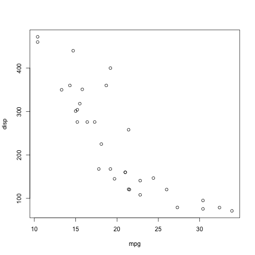
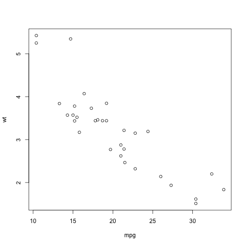
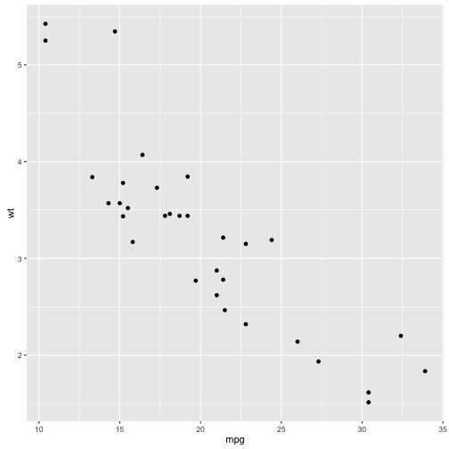

## 讀取 Data Frame 常用技巧: `attach() and detach()

- The `attach()` adds the data frame to the R search path. When a variable name is encountered, data frames in the search path are checked in order to locate the variable. The `detach()` removes the data frame from the search path.


```r
summary(mtcars$mpg)
plot(mtcars$mpg, mtcars$disp)
```


```r
plot(mtcars$mpg, mtcars$wt)
```


can be written as


```r
attach(mtcars)
summary(mpg)
plot(mpg, disp)
```


```r
plot(mpg, wt)
```


```r
detach(mtcars)
```


---
## 讀取 Data Frame 常用技巧: with()` and `within()`

- Alternatively, use `with()`. The statements within the {} brackets are evaluated with reference to the mtcars data frame. You don't have to worry about name conflicts here.


```r
with(mtcars, {
       summary(mpg, disp, wt)
       plot(mpg, disp)
       plot(mpg, wt)}
       )
```



- Note: if you need to create objects that will exist outside of the with() construct, use the special assignment operator <<- instead of the standard one <-. It will save the object to the global environment outside of the `with()` call. 


```r
with(mtcars, {
        nokeepstats <- summary(mpg)
        keepstats <<- summary(mpg)}
        )
```

- The `within()` is similar to the `with()` function, but allows you to modify the data frame.


---
## 進階對於 Data Frame 的處理（下週）

generally, it involves:

- Creating new variables
- Recoding variables
- Renaming variables
- Handling with dates and missing values
- Selecting and dropping variables % plyr and loop: next time

And some more advanced skills

- Sorting dataset
- Merging dataset (via `plyr` package)
- Subsetting dataset
- Aggregation and restructuring data (via `reshape` package)


---
## 列表 List 

- 可以由不同類型的數據組合在一起。list 中的每個元素也可以有不同長度。
- **create, access, manipulate**


```r
# create
v1 <- c(1:10)
v2 <- c("life", "is", "short")
m1 <- matrix(c(1:9), nrow=3)
f1 <- factor(c("positive", "negative", "negative", "neutral", "positive"))
name <- c("shukai", "shikai", "yuyun")
R <- c(60, 90, 92)
PYTHON <- c(60, 95, 93)
piano <- c("great", "ok","ok")
df1 <- data.frame(name, R, PYTHON, piano)
mylist <- list(v1,v2,m1,f1, df1)
# 命名(注意語法！)
mylist <- list(num = v1, char = v2, mat = m1, fac = f1, daframe = df1)
```


---
## 列表 List 


```r
## access: three ways: [[index]], [[element.name]], list$element.name
mylist[[1]]
```

```
## Error in eval(expr, envir, enclos): 找不到物件 'mylist'
```

```r
mylist[["num"]]
```

```
## Error in eval(expr, envir, enclos): 找不到物件 'mylist'
```

```r
mylist$num
```

```
## Error in eval(expr, envir, enclos): 找不到物件 'mylist'
```


---
## Data I/O 資料的輸入 

- `read.table()` 是最基本的資料輸入函式。至少有幾個參數要了解：`file, header, sep, stringAsFactors`

  - **file**: 相對路徑或絕對路徑，用 `/` 或是 `\\` 來表示。(e.g., OSX `"~/dsR/data"`, Windows `"C:\\dsR\\data"`)
  - **header**: 邏輯值。設成 TRUE，會將第一個 row 當成變數名。
  - **sep**: 分隔符號。預設為空格。
  - **stringAsFactors**: 預設是將字串的資料類型轉換成 factor 變數。想要字串被當成字串，則設成 FALSE.
  - For data exported from Excel, use `na.strings = c("", "#N/A", "#DIV/0!", "#NUM!")`.
  - **fill**: Load data file with columns of unequal length. 如果我們的原始檔本身,有不同的 columns 長度,那麼我們用`fill=TRUE`來補上 blank。


---
## 給還沒習慣路徑概念的人


```r
data <- read.table(file.choose()) # for MAC/Linux
data <- read.table(choose.files()) # for Windows
```

---
## 了解預設值


---
## Data I/O 資料的輸出 

- `row.names` 和 `col.names` 都是邏輯值。設成 TRUE 則會將 row or column names 一起輸出。


```r
write.csv(data, "~/dsR/data.csv",
          row.names    = FALSE,
          fileEncoding = "utf8"
)
```


---
## In-class Exercise [1] 練習讀取外部檔案

[Personality](http://personality-project.org/r/#getdata)


```r
personality <- read.table(
  "http://personality-project.org/r/datasets/maps.mixx.epi.bfi.data", 
  header = TRUE) # or: header = T
```


---
## 文字編碼問題
### 「編碼」就是將位元組合變成人類可讀文字的規則。

- 在 windows 環境下讀取含有中文字以 utf8 編碼的檔案，有兩種建議做法

```r
# A
dat1 <- read.csv("data/ubike-sample-data-utf8.csv", fileEncoding="utf8")
```

```
## Warning in file(file, "rt", encoding = fileEncoding): 無法開啟檔案 'data/
## ubike-sample-data-utf8.csv' ：No such file or directory
```

```
## Error in file(file, "rt", encoding = fileEncoding): 無法開啟連結
```

```r
# B
f <- file("data/ubike-sample-data-utf8.csv", encoding="utf8" )
dat1 <- read.csv(f)
```

```
## Warning in open.connection(file, "rt"): 無法開啟檔案 'data/ubike-sample-
## data-utf8.csv' ：No such file or directory
```

```
## Error in open.connection(file, "rt"): 無法開啟連結
```

- 正體中文資料的編碼： mostly encoded with *utf-8* or *big5*


---
## 基本繪圖 

- `plot()` 是基本作圖函式。
- `qplot()` 是 `ggplot2` 作圖套件的一個基本作圖函式，基本用法類似，但較美觀?


```r
plot(x = mtcars$mpg, y = mtcars$wt)
library(ggplot2)
```


```r
qplot(mpg, wt, data=mtcars)
```




---
## In-class Exercise [2] 練習讀取外部檔案

[臺北市政府資料開放平台](http://data.taipei/opendata/)
[桃園市政府資料開放平台](http://data.tycg.gov.tw/opendata)


```r
traffic <- read.csv("~/dsR/data/traffic.csv", header = TRUE, fileEncoding = "big5", stringsAsFactors = FALSE)

write.csv(ty,file = "traffic2.csv",row.names = F, fileEncoding="utf-8")
sum(is.na(traffic))
```


<!-- --- -->
<!-- ## Textual data preprocessing -->

<!-- - 使用 `jiebaR` (0.81 for R version 3.2.4) -->
<!-- ```{r} -->
<!-- library(jiebaR) -->
<!-- ##  Using default settings to initialize a worker. -->
<!-- cutter = worker() -->
<!-- segment( "給我六個小時砍樹，我會花前四個小時磨斧", cutter) -->
<!-- ``` -->


---
## 複習時間

> `Rmarkdown` 等到目前的各種問題


---
## Homework (見課程網站)
### 個人作業 [1] (80%)
### 小組作業 [2] (20%)


