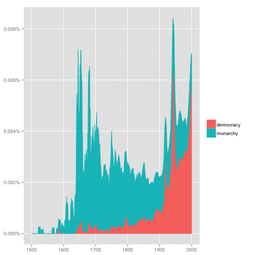
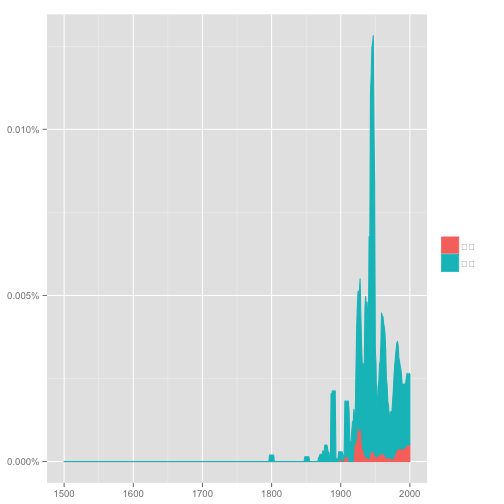
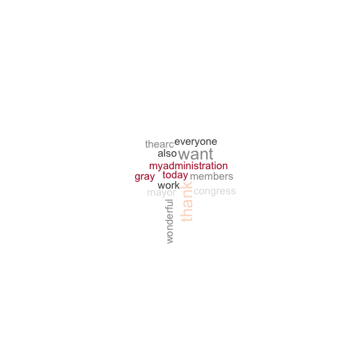

## 數值資料探索分析

[numeric.EDA](LDP35_ExploratoryDataAnalysis.pdf)

---
## 文本資料探索分析

- Textual statistics (local and global)
- Textual data transformatio: from textual information to numerical vectors
- Corpus-based analysis and manual annotation (e.g., conversation structure) 

參考 [text statistics]


--- bg:#FFFAF0
## 大綱

1. Exploratory Data Analysis
2. Corpus and linguistic annotation
2. Crash course for R: Visualization

---
## 語料庫：概念

- 語料庫 (Corpus) 是自然語言處理與文本解析的基礎建設。
- 標記 (annotation) 是核心。It's linguistic in nature.

> Good annotations support good applications


---
## 語料庫：工具

### 一般主要提供以下功能：
  
- Corpus building and indexing
- Concordance
- Frequency list
- (Grammatical) Collocations (and colligations)
- Keywords
- Thesaurus
- ngram
- Visualization

---
## 語料庫：網路服務

- 較具特色的(商用)系統：[Word Sketch Engine](https://www.sketchengine.co.uk/)
- 較具特色的(開放)系統 [COPENS](http://lopen.linguistics.ntu.edu.tw/copens) <- 敝帚自珍

</img>


---
## 語料庫練習

- 我們用斷過詞的總統文告版本來練習看看。

---
## 語料庫：較新的玩意 [I]

- [collocation network: Graphcoll](http://www.extremetomato.com/projects/graphcoll/) 
- [研究全文](https://benjamins.com/#catalog/journals/ijcl.20.2.01bre/fulltext)


---
## 語料庫：較新的玩意 [II]

[Google book ngram](https://books.google.com/ngrams/) 


---
## 用 R 玩看看

- [`ngramr`](https://github.com/seancarmody/ngramr): R package to query the Google Ngram Viewer 


```r
require(ngramr)
require(ggplot2)
ggram(c("monarchy", "democracy"), year_start = 1500, year_end = 2000, 
      corpus = "eng_gb_2012", ignore_case = TRUE, 
      geom = "area", geom_options = list(position = "stack")) + 
      labs(y = NULL)
```

 

---
## 這個圖怎麼解釋


---
## [Exercise] 愛人與太太的消長


```r
# rownames(corpuses) 
ggram(c("情人", "太太"), year_start = 1500, year_end = 2000, 
      corpus = "chi_sim_2012", ignore_case = TRUE, 
      geom = "area", geom_options = list(position = "stack")) + 
      labs(y = NULL)
```

 


---
## 疑問
### 這和 `tm` 套件的 `Corpus()` 差別？


---
## 語料庫：標記、標記、標記（很重要的意思）


- 大型的語料標記系統：[GATE](http://gate.ac.uk), [UIMA](http://www.anc.org/software/uimautils/)
- 各個 lab 可能都有自己的想法 [蘿蔔標 lope.anno](http://140.112.147.121:8001/lope.anno/)
- 語言訊息（語音語法語意語用）、概念、知識、情緒、<span style="color:green; font-weight:bold">什麼都可以標</span>


---
## 標記的重要

第一層意義：

- 如果先標好了詞類訊息，語音合成就不會把當名詞的 contract 和當動詞的 contract 唸錯。
- 如果先標好了詞類訊息，命名實體 (Named Entities) 辨識器就容易把 *highest-ranking general* 和 *the general opinion* 中的 general (頭銜/形容詞) 分開來。

第二層意義：

- 沒有標記，面對小型資料就容易受限。
- 研究與應用的想像力因而受限。


---
## 標記的重點知識

- 標記語言選擇 `xml`, `json`
- 標記標籤 (tagset) 的設計
- 標記者的同意率量度 (inter-annotator agreement)


---
## 

- 用 RStudio 來開啟與編輯 xml 文件 (`data/week7/sonnet130.xml`)。（也可以用其他支援 xml 的編輯器, e.g., `Atom` 或 線上轉檔工具 <http://codebeautify.org/xmlviewer>） 


--- bg:#FFFAF0
## 大綱

1. Exploratory Data Analysis
2. Corpus and linguistic annotation
3. __**Crash course for R: Visualization**__


---
## Basic and Interactive Plots

- 取決於什麼樣的資料型態與要看什麼樣的關係。
- 製圖流程判斷
- The main objective of a visualization is to grab the attention of its audience and make the optimal use of the data available. The audience should be able to get most of its information from the visualization itself.

</img>


---
## Scatter plot

- Scatter plots are used primarily to conduct a quick analysis of the relationships among different variables in our data.
- (add elements such as text, labels, and lines.)


```r
plot(cars)
```


---
## Advanced scatter plot


---
## 3D scatter


---
## Bar chart


---
## Interactive Bar chart


---
## Map 也沒問題


---
## 3D 動畫都可以

- higher dimensions or multivariate data


---
## 網路資料很輕鬆


---
## 重點來了：文本資料怎麼辦

- 我們想要利用視覺化技術探勘文本中的訊息、趨勢、模式變化。
  - 批踢踢語料中呈現的鄉民行為與社會網路
  - 不同作者的書寫風格
  - （選前選後的）政治觀點、主張、價值比較

- 基本的可能
  - 文字雲 (word cloud) 與比較
  - 關聯圖 (correlation plot) 與詞組樹 (phrase tree)
  - 調整字型 (custom fonts) 與風格 


---
## Word Cloud

- A word cloud is simply a graphical representation in which the size of the font used for the word corresponds to its frequency relative to others. Bigger the size of the word, higher is its frequency. 

- `tm`, `wordcloud`, `RColorBrewer` 就可以做到。

 

---
## 也可以丟詞頻表

 

---
## 


```
## Warning in file(con, "r"): 無法開啟檔案 'obama.txt' ：No such file or
## directory
```

```
## Error in file(con, "r"): 無法開啟連結
```

 

---


```
## Error in eval(expr, envir, enclos): 沒有這個函數 "windowsFonts"
```

```
## Warning in mclapply(unname(content(x)), termFreq, control): all scheduled
## cores encountered errors in user code
```

```
## Error in UseMethod("meta", x): 沒有適用的方法可將 'meta' 套用到 "character" 類別的物件
```

---
## 文字雲也可以比較

- To construct a comparison cloud, we require the data to be in the form of a term matrix. The tm package provides us with the `TermDocumentMatrix()` function that constructs a term document matrix:
- 比較馬英九與蔣經國


```
## Error in DirSource("speech/"): empty directory
```

```
## Error in DirSource("speech/"): empty directory
```

```
## Warning in tm_map(data, content_transformer(tolower)): 重新啟動插斷的約定求
## 值
```

```
## Error in tm_map(data, content_transformer(tolower)): 無法開啟檔案 '/Users/shukai/Dropbox/Linguistic.Analysis.and.Data.Science/lads/lectures/06/.cache/unnamed-chunk-7_0355621af3e31629bb64af054af5fcf9.rdb' ：No such file or directory
```

```
## Warning in tm_map(data, removePunctuation): 重新啟動插斷的約定求值
```

```
## Warning in tm_map(data, removePunctuation): 重新啟動插斷的約定求值
```

```
## Error in tm_map(data, removePunctuation): 無法開啟檔案 '/Users/shukai/Dropbox/Linguistic.Analysis.and.Data.Science/lads/lectures/06/.cache/unnamed-chunk-7_0355621af3e31629bb64af054af5fcf9.rdb' ：No such file or directory
```

```
## Warning in tm_map(data, removeNumbers): 重新啟動插斷的約定求值
```

```
## Warning in tm_map(data, removeNumbers): 重新啟動插斷的約定求值
```

```
## Error in tm_map(data, removeNumbers): 無法開啟檔案 '/Users/shukai/Dropbox/Linguistic.Analysis.and.Data.Science/lads/lectures/06/.cache/unnamed-chunk-7_0355621af3e31629bb64af054af5fcf9.rdb' ：No such file or directory
```

```
## Warning in tm_map(data, removeWords, stopwords("english")): 重新啟動插斷的
## 約定求值
```

```
## Warning in tm_map(data, removeWords, stopwords("english")): 重新啟動插斷的
## 約定求值
```

```
## Error in tm_map(data, removeWords, stopwords("english")): 無法開啟檔案 '/Users/shukai/Dropbox/Linguistic.Analysis.and.Data.Science/lads/lectures/06/.cache/unnamed-chunk-7_0355621af3e31629bb64af054af5fcf9.rdb' ：No such file or directory
```

```
## Warning in tm_map(data, removeWords, c("applause", "Applause",
## "APPLAUSE", : 重新啟動插斷的約定求值
```

```
## Warning in tm_map(data, removeWords, c("applause", "Applause",
## "APPLAUSE", : 重新啟動插斷的約定求值
```

```
## Error in tm_map(data, removeWords, c("applause", "Applause", "APPLAUSE", : 無法開啟檔案 '/Users/shukai/Dropbox/Linguistic.Analysis.and.Data.Science/lads/lectures/06/.cache/unnamed-chunk-7_0355621af3e31629bb64af054af5fcf9.rdb' ：No such file or directory
```

```
## Warning in TermDocumentMatrix(data): 重新啟動插斷的約定求值
```

```
## Warning in TermDocumentMatrix(data): 重新啟動插斷的約定求值
```

```
## Error in TermDocumentMatrix(data): 無法開啟檔案 '/Users/shukai/Dropbox/Linguistic.Analysis.and.Data.Science/lads/lectures/06/.cache/unnamed-chunk-7_0355621af3e31629bb64af054af5fcf9.rdb' ：No such file or directory
```

```
## Error in as.matrix(data): error in evaluating the argument 'x' in selecting a method for function 'as.matrix': 錯誤: 無法開啟檔案 '/Users/shukai/Dropbox/Linguistic.Analysis.and.Data.Science/lads/lectures/06/.cache/unnamed-chunk-7_0355621af3e31629bb64af054af5fcf9.rdb' ：No such file or directory
```

```
## Warning in colnames(data) <- c("bush", "obama"): 重新啟動插斷的約定求值
```

```
## Warning in colnames(data) <- c("bush", "obama"): 重新啟動插斷的約定求值
```

```
## Error in colnames(data) <- c("bush", "obama"): 無法開啟檔案 '/Users/shukai/Dropbox/Linguistic.Analysis.and.Data.Science/lads/lectures/06/.cache/unnamed-chunk-7_0355621af3e31629bb64af054af5fcf9.rdb' ：No such file or directory
```

```
## Warning in ncol(term.matrix): 重新啟動插斷的約定求值
```

```
## Warning in ncol(term.matrix): 重新啟動插斷的約定求值
```

```
## Error in ncol(term.matrix): 無法開啟檔案 '/Users/shukai/Dropbox/Linguistic.Analysis.and.Data.Science/lads/lectures/06/.cache/unnamed-chunk-7_0355621af3e31629bb64af054af5fcf9.rdb' ：No such file or directory
```


---
## 用 correlation plot 來觀察文本差異


---
## 詞組樹

- A phrase tree or a word tree provides useful insight into text as it provides a context and not just the frequency of words.

<https://www.jasondavies.com/wordtree/>


---
## 再講一個 motion chart

<iframe width="420" height="315" src="https://www.youtube.com/embed/6LUjgHPhxRw" frameborder="0" allowfullscreen></iframe>

--- &interactive

## Data Science Analytics (makes advances like never before)


```r
require(googleVis)
load("mot/mot.RData")
```

```
## Warning in readChar(con, 5L, useBytes = TRUE): 無法開啟壓縮過的檔案 'mot/
## mot.RData'，可能的原因是 'No such file or directory'
```

```
## Error in readChar(con, 5L, useBytes = TRUE): 無法開啟連結
```

```r
#head(convdata)
#head(compdata)
Modal <- gvisMotionChart(convdata, 
                         idvar="VERB", 
                         timeva="DECADE") 
```

```
## Error in match(vars, names(data)): 找不到物件 'convdata'
```

```r
plot(Modal) 
```

```
## Error in plot(Modal): error in evaluating the argument 'x' in selecting a method for function 'plot': 錯誤: 找不到物件 'Modal'
```


---
## 從多變量量化語言學角度下的文本視覺化

Visualization of textual data (Ludovic Lebart and Marie Piron)


---
## Homework Bonus (20151022)


---
## Reference

Graham Wilcock. 2009. *Introduction to Linguistic Annotation and Text Analytics*.


