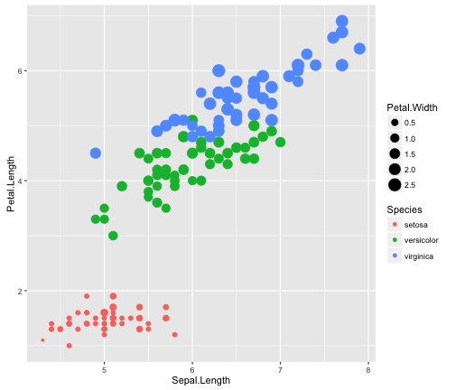
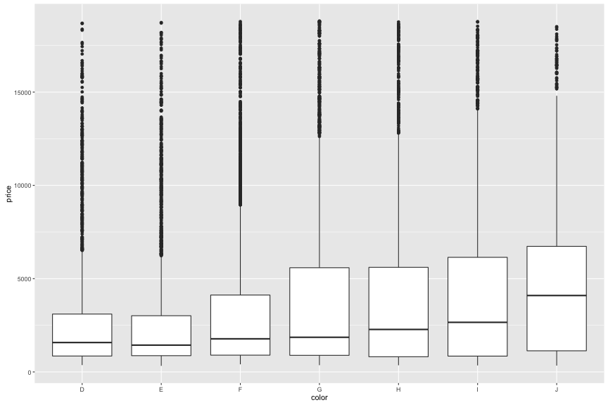

EDA with dplyr and ggplot2
========================================================
date: "2016-10-27"


## `dplyr`: a Grammar of Data Manipulation

- Great for data exploration and transformation
- Intuitive to write and easy to read, especially when using the *chaining* syntax
- Fast on data frames

### Basics
Data manipulation 五個基本動作：`filter()`, `select()`, `arrange()`, `mutate()`, `summarise()`。
注意：直行（VAR）橫列 (OBS)

- 篩選 `filter()`: 按給定的邏輯判斷篩選出符合要求的 OBS, 類似於 `subset()`。
- 選擇 `select()` : 用 VAR 作參數來選擇 OBS。
- 排列 `arrange()`: 按給定的 VAR 依次對 OBS 進行排序。類似於 `order()`。
- 增行 `mutate()`: 對已有 VAR 進行運算並添加為新的 VAR。類似於 `transform()`。
- 摘要 `summarise()`: 對 df 調用其它函數進行 summarise, 並回傳一維結果。

First argument is a data frame, and subsequent arguments say what to do with data frame.


```r
# load packages
suppressMessages(library(dplyr))
library(hflights)

# explore data: flights departing from two Houston airports in 2011
data(hflights)
head(hflights)
```

- 第一步：`tbl_df()` creates a 「local data frame」, which is simply a wrapper for a data frame that prints nicely.


```r
# convert to local data frame
flights <- tbl_df(hflights)

# printing only shows 10 rows and as many columns as can fit on your screen
flights

# you can specify that you want to see more rows
#print(flights, n=20)

# convert to a normal data frame to see all of the columns
#data.frame(head(flights))
```

## Filter (keep rows marching criteria) : 篩選 observations

- Base R approach to filtering forces you to repeat the data frame's name, and dplyr approach is simpler to write and read.
- `filter(df, 回傳符合邏輯條件的 rows)`


```r
# base R approach to view all flights on January 1
#flights[flights$Month==1 & flights$DayofMonth==1, ]

# dplyr approach
# note: you can use comma or ampersand to represent AND condition
filter(flights, Month==1 & DayofMonth==1)
```


```r
# use pipe for OR condition
filter(flights, UniqueCarrier=="AA" | UniqueCarrier=="UA")

# you can also use %in% operator
#filter(flights, UniqueCarrier %in% c("AA", "UA"))
```


## select: Pick columns by name 選取變量

- Base R approach is awkward to type and to read, dplyr approach uses similar syntax to filter.


```r
# base R approach to select DepTime, ArrTime, and FlightNum columns
#flights[, c("DepTime", "ArrTime", "FlightNum")]

# dplyr approach
select(flights, DepTime, ArrTime, FlightNum)
```


```r
# use colon to select multiple contiguous columns, and use `contains` to match columns by name
# note: `starts_with`, `ends_with`, and `matches` (for regular expressions) can also be used to match columns by name
# 或者使用 - 來排除某列
select(flights, Year:DayofMonth, contains("Taxi"), contains("Delay"))
```

> Chaining/Pipelining 
- Usual way to perform multiple operations in one line is by nesting.
- Can write commands in a natural order by using the `%>%` infix operator (which can be pronounced as 「then」)
- Chaining increases readability significantly when there are many commands (Operator is automatically imported from the `magrittr` package)


```r
# nesting method to select UniqueCarrier and DepDelay columns and filter for delays over 60 minutes
filter(select(flights, UniqueCarrier, DepDelay), DepDelay > 60)

# chaining method
flights %>%
    select(UniqueCarrier, DepDelay) %>%
    filter(DepDelay > 60)
```

再一個例子

```r
# create two vectors and calculate Euclidian distance between them
x1 <- 1:5; x2 <- 2:6
sqrt(sum((x1-x2)^2))

# chaining method
(x1-x2)^2 %>% 
  sum() %>% 
  sqrt()
```


## `rename()` 重命名變量 variable names

`rename(tbl, newname = oldname,...)`


## `arrange()`: Reorder rows

- `arrange(依 variable 或是 variables 來排序)`, `desc()` 是倒序。


```r
# base R approach to select UniqueCarrier and DepDelay columns and sort by DepDelay
#flights[order(flights$DepDelay), c("UniqueCarrier", "DepDelay")]

# dplyr approach
flights %>%
    select(UniqueCarrier, DepDelay) %>%
    arrange(DepDelay)

# use `desc` for descending
# flights %>%
#     select(UniqueCarrier, DepDelay) %>%
#     arrange(desc(DepDelay))
# 
```

## `mutate()`: Add new variables 擴展新 variable（在後面）


- Create new variables that are functions of existing variables, 類似於`transform()`


```r
# base R approach to create a new variable Speed (in mph)
#flights$Speed <- flights$Distance / flights$AirTime*60
#flights[, c("Distance", "AirTime", "Speed")]

# dplyr approach (prints the new variable but does not store it)
flights %>%
    select(Distance, AirTime) %>%
    mutate(Speed = Distance/AirTime*60)
```


```r
# store the new variable
flights <- flights %>% 
  mutate(Speed = Distance/AirTime*60)
```


## `summarise()`: Reduce variables to values

- Primarily useful with data that has been grouped by one or more variables
- `summarise()` uses the provided *aggregation* function to summarise each group

## Group Data
- 加上分組操作`group_by()`這個概念結合起來時非常強大!


```r
# base R approaches to calculate the average arrival delay to each destination
# head(with(
#   flights, 
#   tapply(ArrDelay, Dest, mean, na.rm=TRUE))
#   )
# head(aggregate(ArrDelay ~ Dest, flights, mean))


# dplyr approach: create a table grouped by Dest, and then summarise each group by taking the mean of ArrDelay
flights %>%
    group_by(Dest) %>%
    summarise(avg_delay = mean(ArrDelay, na.rm=TRUE))
```

- `summarise_each()` allows you to apply the same summary function to multiple columns at once (Note: `mutate_each()` is also available)


```r
# for each carrier, calculate the percentage of flights cancelled or diverted
flights %>%
    group_by(UniqueCarrier) %>%
    summarise_each(funs(mean), Cancelled, Diverted)
```


```r
# for each carrier, calculate the minimum and maximum arrival and departure delays
flights %>%
    group_by(UniqueCarrier) %>%
    summarise_each(funs(min(., na.rm=TRUE), max(., na.rm=TRUE)), matches("Delay"))
```

- Helper function `n()` counts the number of rows in a group
- Helper function `n_distinct(vector)` counts the number of unique items in that vector


```r
# for each day of the year, count the total number of flights and sort in descending order
flights %>%
    group_by(Month, DayofMonth) %>%
    summarise(flight_count = n()) %>%
    arrange(desc(flight_count))
```


```r
# for each destination, count the total number of flights and the number of distinct planes that flew there
flights %>%
    group_by(Dest) %>%
    summarise(flight_count = n(), plane_count = n_distinct(TailNum))
```

- Grouping can sometimes be useful without summarising


```r
# for each destination, show the number of cancelled and not cancelled flights
flights %>%
    group_by(Dest) %>%
    select(Cancelled) %>%
    table() %>%
    head()
```

- **Summarise function** takes n inputs and returns 1 value
- **Window function** takes n inputs and returns n values. Includes ranking and ordering functions (like `min_rank()`), offset functions (`lead()` and `lag()`), and cumulative aggregates (like `cummean()`).


------------------------------------
# `ggplot2`: a Grammar of Graphics

> 先看看這個[plots to avoid](http://genomicsclass.github.io/book/pages/plots_to_avoid.html)

- `plot()` - `qplot()` - `ggplot()`  見網站講義 (`VisR_quick.R`)


```r
library(ggplot2)
qplot(Sepal.Length, Petal.Length, data = iris, color = Species, size = Petal.Width)
```




------------------------------------------------
## Rapid Data Exploration with dplyr and ggplot


```r
diamonds %>%                      # Start with the 'diamonds' dataset
  filter(cut == "Ideal") %>%      # Then, filter down to rows where cut == Ideal
  ggplot(aes(x=color,y=price)) +  # Then, plot using ggplot
    geom_boxplot()                #  with and create a boxplot
```




<!-- ## Exercise -->
<!-- > http://sharpsightlabs.com/blog/2014/12/23/data-analysis-example-r-supercars-part2/ -->


<!-- ```{r} -->
<!-- suppressMessages(require(RCurl)) -->

<!-- # Import and read data from Google Spreadsheet -->
<!-- myCsv <- getURL("https://docs.google.com/spreadsheets/d/1PUZlBLgRGI-6hnDF_hLcn8hmxksIBIp6VZEncgt52wk/pub?output=csv") -->
<!-- RoadRatings <- read.csv(textConnection(myCsv), stringsAsFactors = FALSE) -->

<!-- # Ratings in the City should only be from 1-10, anything else is a type or inaccurate, so filter out -->

<!-- RoadRatings <- filter(RoadRatings, Overall <=10 & Overall >= 1) -->

<!-- ``` -->

<!-- - Count how many road blocks there are per road rating category, then create a data frame -->

<!-- ```{r} -->
<!-- RoadsPerRating <- data.frame(table(RoadRatings$Overall)) -->
<!-- names(RoadsPerRating) <- c("Rating", "NumRoads") #rename columns so they are easier to understand -->
<!-- RoadsPerRating$Rating <- as.numeric(RoadsPerRating$Rating) #convert rating to numeric data type -->
<!-- ``` -->

<!-- - This step is in preparation for the data visualization. Categorize the road ratings into good, fair, and poor -->

<!-- ```{r} -->
<!-- RoadsPerRating$Status <- "Fair" -->
<!-- RoadsPerRating$Status[RoadsPerRating$Rating > 7] <- "Good" -->
<!-- RoadsPerRating$Status[RoadsPerRating$Rating < 6] <- "Poor" -->
<!-- RoadsPerRating$Status <- factor(RoadsPerRating$Status, levels = c("Poor", "Fair", "Good")) -->
<!-- ``` -->

<!-- - Visualize the data using ggplot -->

<!-- ```{r} -->
<!-- require(ggplot2) -->
<!-- ggplot(RoadsPerRating, aes(Rating, NumRoads, fill = Status)) + #calls out data and aesthetics that should be used (in aes(x-axis, y-axis, extra information)) -->
<!--   geom_bar(stat="identity") + #indicates we will create a bar chart. "identity" makes the heights of the bars equal the value you are using on the y-axis -->
<!--   scale_fill_manual(values=c("red", "yellow", "green")) + #determine color of each bar (this is optional but makes sense for good, fair, poor) -->
<!--   labs(title="Distribution of Roads by Rating", #name the title and axes -->
<!--        x = "Rating", -->
<!--        y = "Number of Road Blocks") + -->
<!--   scale_x_continuous(breaks = c(0:10)) + # make a tick mark at every Rating value -->
<!--   theme_bw() #take out the background color -->
<!-- ``` -->


------------------------
# Homework

1. (Individual, 100 pt)
========================


```r
#library(downloader)
#url <- "https://../../birth2006.csv"
#filename <- "birth2006.csv"
#if (!file.exists(filename)) download(url,filename)
#birth <- read.csv("birth2006.csv")
#tbl_df(birth)

# 也可以直接下載後再載入
birth <- tbl_df(read.csv("birth2006.csv", row.names = 1))
```

> 資料說明: `birth2006.csv`檔，包含了 427323 筆紀錄，與 13 筆變量。變量的意義如下：
> - `DOB_MM` and `DOB_WK` : 出生的月份與星期。
> - `DBWT` : 北鼻的重量。
> - `WTGAIN`：母親妊娠期北鼻的增加重量。
> - `SEX` AND `APGAR5`：北鼻的性別和 APGAR5 分數。
> - `DPLURAL` ：胎數
> - `ESTGEST`：預估的懷孕週數。
> - `DMETH_REC`：剖腹產(c-section) 或自然產(vaginal)


#### 探索分析

- 經過基本審視資料，可以發現 *在週日出生的北鼻比週間還少*, 請用程式產生數據說明這個事實，並且做出以適當的圖形。 
- 對於上述事實有個猜想是大部分的生產方式都是採「剖腹產」，而通常「剖腹產」的手術較少排在週日。請用程式產生數據說明這個事實。
- 如果我們要用圖形初步探索以下的變量之間是否有關聯，要如何利用`ggplot2`作圖?
  - *胎數與生產方式與北鼻體重*
  - *北鼻的體重成長與出生時重量*


2. (Group, 20 pt bonus)
========================

- 找政府的開放資料(可嘗試各種類型:CSV/XML/JSON)，讀入並利用 `dplyr` + `ggplot2` 做 Exploratory Data Aanalysis. [參考](http://www.idealyzt.com/%E5%A6%82%E4%BD%95%E4%BD%BF%E7%94%A8-r-%E5%8F%96%E5%BE%97%E9%96%8B%E6%94%BE%E8%B3%87%E6%96%99/)


```r
# for zipped data (tested on MAC)
download.file("http://data.gov.tw/...",destfile = "test.zip", mode='wb')
unzip(zipfile="test.zip")
```


3. (預習：`ggplot()`)
=========================

中文資料參考

http://molecular-service-science.com/2013/11/27/r-ggplot-tutorial-1/

http://molecular-service-science.com/2014/01/23/r-ggplot-tutorial-2/

